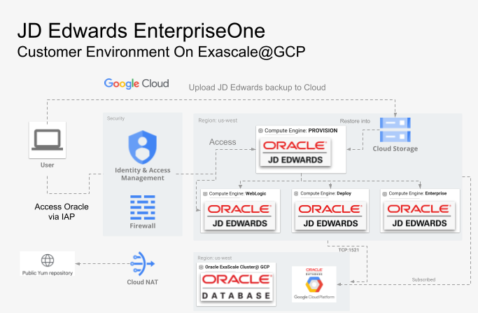

# Oracle JD Edwards EnterpriseOne Customer Environment on Oracle Exascale@GCP

This folder provides Terraform infrastructure-as-code automation to deploy Oracle JD Edwards EnterpriseOne the full set of infrastructure running on Google Cloud Platform and database into Oracle Exascale @GPC.

## Purpose

This artifact provides a fully automated framework to deploy an  **Oracle JD Edwards EnterpriseOne** environment onto a clean Google Cloud Platform (GCP) project. Utilizing Terraform for infrastructure-as-code, this toolkit eliminates the manual complexity typically associated with provisioning Oracle JDE require infrastrucure setup.

The primary goals of this repository are to:

* **Accelerate Evaluation:** Allow enterprise architects, administrators, and business users to rapidly stand up an operational JDE Enterprise One instance to evaluate its functionality, workflow engine, and user experience on GCP.
* **Benchmark Performance:** Provide an isolated sandbox environment to test, review, and baseline the performance capabilities of Oracle workloads running on Google Cloud Compute Engine and SSD Persistent Disks.
* **Demonstrate Best Practices:**  Serve as a reference implementation for cloud infrastructure layout, Identity-Aware Proxy (IAP) secure tunneling, and automated deployment patterns for legacy enterprise applications.

*Note: This environment is intended for demonstration, testing, and proof-of-concept (PoC) purposes and is not intended for production workloads.*


## Architectural Diagram

### Oracle JD Edwards on GCP



## Prerequisites

Before starting, ensure the following requirements are met:

### Environment
- GCP Project: A Google Cloud project must already exist for this deployment. Note the `PROJECT_ID`.
- Make: Install the `make` tool (version >= 4.3 recommended).
- Subscribe to Oracle Database@Google Cloud
- Connect GCP Project with Oracle OCI account
- Create an Oracle SR to increase Exascale DB Storage Vault quota to at least 1T

### Quota Requirements
Before deploying Toolkit, verify that your GCP project has sufficient resource quotas in the target region.

Minimum recommended quotas:
- Persistent Disk SSD (GB): ~ 1T 

Check your current quotas with:

```
gcloud compute regions describe <REGION> --project=<PROJECT_ID> \
  --format="flattened(quotas[].metric,quotas[].limit,quotas[].usage)" | grep SSD
  ```

Action if insufficient:

 - Go to Google Cloud Console – Quotas: https://console.cloud.google.com/iam-admin/quotas

 - Filter for Persistent Disk SSD (GB) in your region.

 - Click EDIT QUOTAS and request the desired increase.

 - Once the quotas are approved, proceed with the next steps.

### IAM

Ensure your GCP account has the following IAM roles:

- `roles/iam.serviceAccountUser` – Use service accounts for VM access  
- `roles/iap.tunnelResourceAccessor` – Connect to VMs using IAP tunneling  
- `roles/compute.osAdminLogin` – SSH/RDP access to VMs via OS Login  
- `roles/compute.instanceAdmin.v1` – Start, stop, and manage VM instances  
- **Storage access (choose one):**  
  - `roles/storage.admin` – Full control of Cloud Storage (buckets and objects), **or**  
  - `roles/storage.objectAdmin` – Object-level control only (least privilege option) 
- **Oracle @GCP:**  
  - `roles/oracledatabase.exadbVmClusterAdmin` – Oracle Database@Google Cloud Exadata Database Service on Exascale Infrastructure VM Cluster Admin 
  - `roles/oracledatabase.exascaleDbStorageVaultAdmin` – Oracle Database@Google Cloud Exadata Database Service on Exascale Infrastructure Storage Vault Admin

  

#### Alternatively, the GCP account can have broad roles like:
- `roles/owner`
- `roles/editor`

## Oracle JD Edwards EnterpriseOne Customer environment Deployment on Exascale@GCP

All Makefile commands should be run from the project root for all the deployments.

### 1. Setup the environment

```bash
# Install required tools
make setup

# Verify GCP account and project
gcloud config list

# Verify GCP access and IAM roles
make verify-gcp-access
```

---

### 2. Authenticate with GCP and configure Application Default Credentials:

Terraform uses Application Default Credentials (ADC) to interact with GCP. Run the following command before initializing Terraform:

```bash
gcloud auth login
```

---

### 3. Deploy Oracle JD Edwards EnterpriseOne Infrastructure

Run the commands below to deploy the Oracle JD Edwards environment that consists of 4 GCP servers and Exascale@GCP resources.
This process will create following OCI resources:
 - OCI Storage Vault
 - OCI Exascale Cluster
 - OCI Exascale Virtual Machine
 - OCI Exascale CDB Database


```bash
# Initialize Terraform backend and modules
make init

# IMPORTANT: Verify the disk type and disk sizes in the infra.auto.tfvars file specially for the database disk size

# Plan the changes
make jde_cust_data_exa_plan

# Deploy the changes
make jde_cust_data_exa_deploy
```

---

### 4. Stage Oracle JD Edwards EnterpriseOne Backup into Google Cloud 

This toolset provisions required GCP infrastructure only and prepares servers with RPM's, users, and other required configuration to run JD Edwards Enterprise One 9.2 on GCP cloud. 
Upload the existing JD Edwards backup into the GCP Bucket provided in step 3. All provisioned VMs have access to the bucket with preinstalled and preconfigured gcloud storage ls and cp.
Use existing on-premises cloning instructions to setup Customer environment in GCP Cloud or refer to the [JD Edwards EnterpriseOne Administration](https://docs.oracle.com/en/applications/jd-edwards/administration/index.html) guide.

Oracle Database at Exascale@GCP will already be pre-created with emtpy pluggalbe database PDB1. In order to put database into exascale:
 - use datapump to load data into PDB1 or
 - restore a custom PDB from backup location into CDB

GCP subnet has TCP:1521 connectivity enabled so database will be available fron JDE subnet to all application tier services for further applcation restore.

*Note: This tool will provide an SSH key (exadb_private_key.pem) that can be used to ssh into the Exascale VM as the os user oracle*

*Note2: Exascale doesn't have direct access to GCP Cloud Storage; use the jde-db server as an intermediate placeholder or see [migration guides](https://docs.oracle.com/en-us/iaas/Content/Database/Tasks/migrating.htm)*

---

### 5. Access Environment

All servers and GCP infrastructure are behind IAP (Identity-Aware Proxy), and no public access is configured. To access provisioned services, it's required to use IAP tunneling using the commands below:

For IAP tunneling purposes, add the below entries to /etc/hosts (win: C:\Windows\System32\drivers\etc\hosts)

```bash
# Mac hosts file 
cat /etc/hosts
127.0.0.1 jde-prov.c.$PROJECT_ID$ jde-prov
127.0.0.1 jde-ent.c.$PROJECT_ID$ jde-ent
127.0.0.1 jde-web.c.$PROJECT_ID$ jde-web
127.0.0.1 jde-dep.c.$PROJECT_ID$ jde-dep

```

Open IAP tunnel

```bash

# open 2 tunnels for provisioning server and JD EntONe
gcloud compute ssh --zone "$ZONE$" "jde-prov" --tunnel-through-iap  \
  --project "$PROJECT_ID$"  -- -L 3000:localhost:3000 -L 8998:localhost:8998
gcloud compute ssh --zone "$ZONE$" "jde-web" --tunnel-through-iap  \
  --project "$PROJECT_ID$"   -- -L 7001:localhost:7001 -L 8000:localhost:8000


```

---

### 5. Destroy Oracle JD Edwards EnterpriseOne Customer environment

```bash
# Destroy JD infrastructure (including buckets, networks and VM)

make jde_cust_data_exa_destroy

```
---

### Notes

- `PROJECT_ID` is auto-detected from `gcloud config` or can be passed explicitly

- Run `make verify-gcp-access` **once** to confirm IAM roles; it is not required for each Terraform command.
